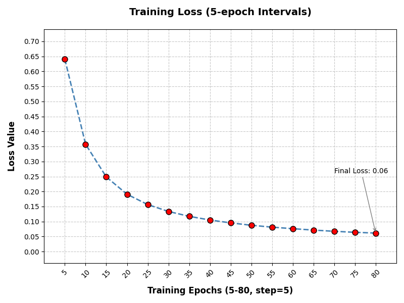
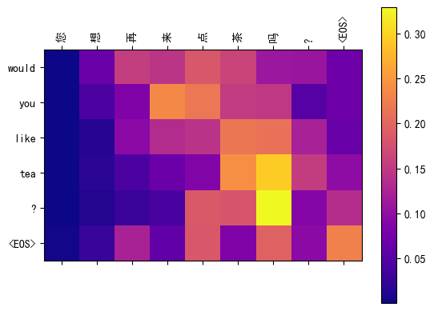
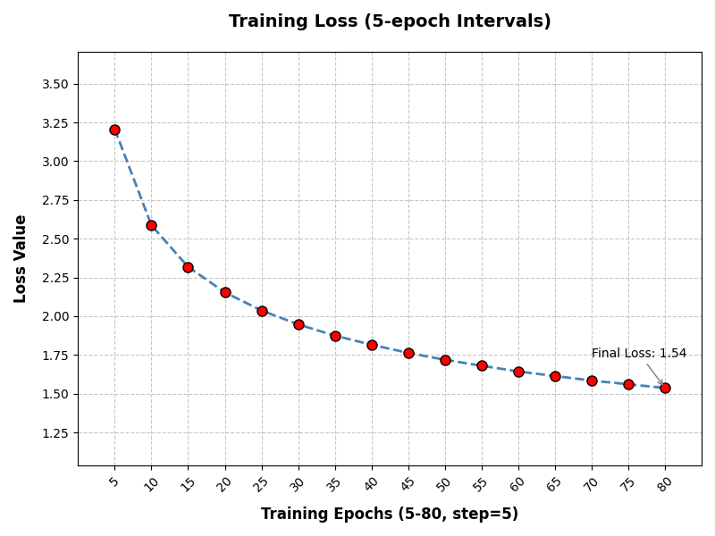
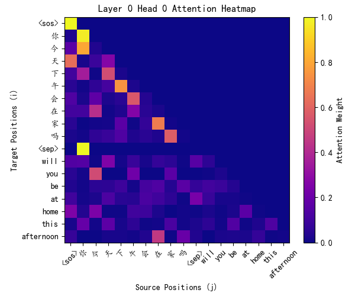
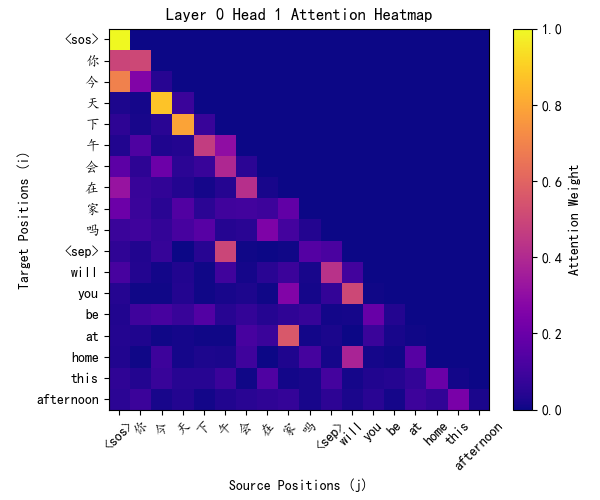
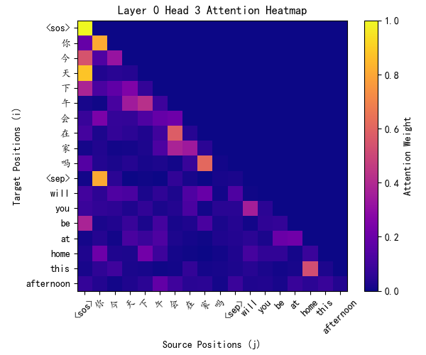
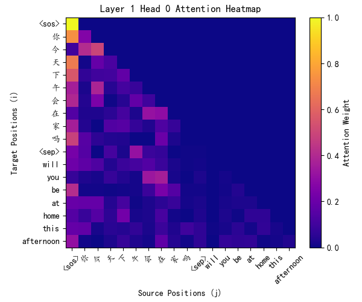
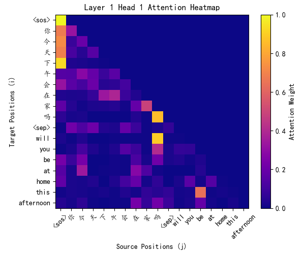
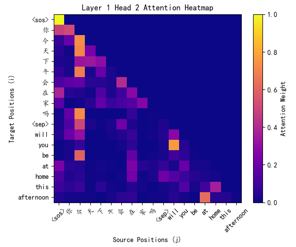
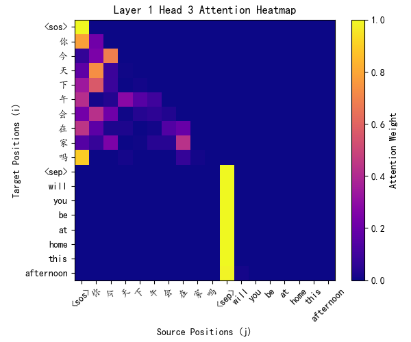

# MDS5122 Deep Learning And Its Application ***Assignment 2***
*Guyuan Xu 224040074*

## Part A: seq2seq

### 1. Load and process the dataset
**Build text pairs list**: 
We want to clean the raw data set and build a `list` of Chinese-English text pairs for future processing, for example
```python
[('嗨。', 'Hi.'),
('你好。', 'Hi.'),
('你用跑的。', 'Run.'),
('住手！', 'Stop!'),
('等等！', 'Wait!'),
('等一下！', 'Wait!'),
('开始！', 'Begin.'),
...
```
**Randomly split the text-pairs list to train-test splits**
`train_test_split(pairs, test_size=0.1, shuffle=True, random_state = 1234)`
**Tokenize all text**: 
The core of processing is to tokenize Chinese and English texts, we 
    - split all English sentence into words and take lower case, for example:
    `How are you today?` $\rightarrow$ `['how', 'are', 'you', 'today']`
    - split all Chinese sentence into words, but treat simplified and traditional chinese as different words, for example:
    `今天天氣真好` $\rightarrow$ `['今','天', '天', '氣','真','好']` 

**Creates 2 vocabulary mapping for characters/tokens in bilingual text pairs seperately** 
- Assign unique IDs to new tokens.
- Add predefined tokens like `<pad>` (padding), `<sos>` (start-of-sequence), `<eos>` (end-of-sequence), and  `<unk>` (unknown token) to handle out-of-vocabulary words during eval (inference).
- Example:
```python
# Chinese       # English
{'<UNK>': 2,    {'<UNK>': 2,
'這': 3,        'there': 3,
'裡': 4,        'used': 4,
'以': 5,        'to': 5,
'前': 6,        'be': 6,
'是': 7,        'an': 7,
'座': 8,        'old': 8,
'舊': 9,        'temple': 9,
...             ....
```
**Converts raw text words into numerical IDs using the prebuilt vocabulary**
- ID Mapping: Replaces each token with its corresponding ID from `vocab`. If a token is not found, it uses the ID of `<unk>`.  
- Example:
    `'今天天气不好'`$\rightarrow$ `['今','天','天','气','不','好']` $\rightarrow$ `[1210, 438, 438, 109, 30, 7]`

**Building `Dataset` and `DataLoader` to feed the model**
- We want to convert the Chinese-English text pairs to id pairs
`['我 會 再 試 一 次 。', 'i will try it again']` $\rightarrow$ `[12, 16, 17, 18, 19, 20, 11], [11, 14, 15, 16, 17]`
- Appending `<EOS>` id `1` to the end to tell the model this is the end of text.
- Then pad ids pair to fixed length (here we have fixed length = 45) since the model always take fixed length as input:
  
```python
(tensor([12, 16, 17, 18, 19, 20, 11,  1,  0,  0,  0,  0,  0,  0,  0,  0,  0,  0,
        0,  0,  0,  0,  0,  0,  0,  0,  0,  0,  0,  0,  0,  0,  0,  0,  0,  0,
        0,  0,  0,  0,  0,  0,  0,  0,  0]),
tensor([11, 14, 15, 16, 17,  1,  0,  0,  0,  0,  0,  0,  0,  0,  0,  0,  0,  0,
        0,  0,  0,  0,  0,  0,  0,  0,  0,  0,  0,  0,  0,  0,  0,  0,  0,  0,
        0,  0,  0,  0,  0,  0,  0,  0,  0]))
```
*Note*: we did not use `BPETokenizer` or other pre-defined tokenizer for tokenizing, we build our own tokenizer (words to ids mapping)

---
### 2. Implement a seq2seq model with attention using PyTorch
We copy the codes [PyTorch Tutorial](https://pytorch.org/tutorials/intermediate/seq2seq_translation_tutorial.html)
### 3. Train the network starting from random initialization
**Loss curve:**
we record traing loss every 5 epochs, we have total 80 epochs.


**Model translation**: 10 examples from test set:

```
input:  您 想 再 来 点 茶 吗 ？
target:  would you like some more tea ?
model:  would you like tea ? <EOS>

input:  她 的 故 事 是 真 的 吗 ？
target:  was her story true ?
model:  is her story true story <EOS>

input:  比 我 想 象 中 的 更 简 单 。
target:  that was easier than i thought it would be
model:  i want less than i remember <EOS>

input:  湯 姆 問 了 幾 個 問 題 。
target:  tom asked a few questions
model:  tom bought questions <EOS>

input:  我 家 附 近 有 一 個 公 園 。
target:  there is a park near my house
model:  near my house <EOS>

input:  我 想 要 一 些 新 鲜 的 鸡 蛋 。
target:  i want some fresh eggs
model:  i want new <EOS>

input:  你 是 从 哪 个 国 家 来 的 ？
target:  what country are you from ?
model:  when are your country ? <EOS>

input:  这 个 城 市 人 口 众 多 。
target:  the city has a large population
model:  two men <EOS>

input:  永 远 别 再 提 它 了 。
target:  don t ever mention that again
model:  never want it again <EOS>

input:  汤 姆 开 始 唱 歌 。
target:  tom started singing
model:  tom started to sing <EOS>

```
**Example of Attention weights HeatMap**
We copy the visualization codes [PyTorch Tutorial](https://pytorch.org/tutorials/intermediate/seq2seq_translation_tutorial.html), with few modification to adapt to Chinese texts.


We input *"would you like tea?"* to model, and the model translate it to *"您想再来点茶吗？"*, which is a fairly exact translation, except the redundant *"再"*.


## Part A: GPT

### 1. Load and process the dataset
In GPT context, we deal with text data differently: 
- we first build a single word-id vocabulary for all Chinese/English words together
- then adding special tokens like `<EOS>, <SOS>, <SEP>` to the vocabulary and assign ids to them, example:
```
{'<pad>': 0,
'<sos>': 1,
'<eos>': 2,
'<sep>': 3,
'嗨': 4,
'hi': 5,
'你': 6,
'好': 7,
'用': 8,
'跑': 9,
'的': 10,
...
```
- We concat Chinese-English pair into 1 sequence and mark start/sep/end positions with speical tokens `<EOS>, <SOS>, <SEP>`, example: `<SOS>你最好休息一下。<SEP>You'd better relax a bit.<EOS>`
- convert all words into ids
**Expected convertion:**
`('你最好休息一下。', "You'd better relax a bit.")` $\rightarrow$ `<SOS>你最好休息一下。<SEP>You'd better relax a bit.<EOS>` $\rightarrow$ `[1, 6, 1110,    7,  936,  937,   17,   18,    3, 2069, 1754,  568,  365, 899, 2]`

- Build `source` and `target` sequence for training: *shift right by 1 position*, then pad to `max_length = 128`, example:
```
(src, tgt) = 
(tensor([   1,    6, 1110,    7,  936,  937,   17,   18,    3, 2069, 1754,  568,
          365,  899,    0,    0,    0,    0,    0,    0,    0,    0,    0,    0,
            0,    0,    0,    0,    0,    0,    0,    0,    0,    0,    0,    0,
            0,    0,    0,    0,    0,    0,    0,    0,    0,    0,    0,    0,
            0,    0,    0,    0,    0,    0,    0,    0,    0,    0,    0,    0,
            0,    0,    0,    0,    0,    0,    0,    0,    0,    0,    0,    0,
            0,    0,    0,    0,    0,    0,    0,    0,    0,    0,    0,    0,
            0,    0,    0,    0,    0,    0,    0,    0,    0,    0,    0,    0,
            0,    0,    0,    0,    0,    0,    0,    0,    0,    0,    0,    0,
            0,    0,    0,    0,    0,    0,    0,    0,    0,    0,    0,    0,
            0,    0,    0,    0,    0,    0,    0,    0]),
 tensor([   6, 1110,    7,  936,  937,   17,   18,    3, 2069, 1754,  568,  365,
          899,    2,    0,    0,    0,    0,    0,    0,    0,    0,    0,    0,
            0,    0,    0,    0,    0,    0,    0,    0,    0,    0,    0,    0,
            0,    0,    0,    0,    0,    0,    0,    0,    0,    0,    0,    0,
            0,    0,    0,    0,    0,    0,    0,    0,    0,    0,    0,    0,
            0,    0,    0,    0,    0,    0,    0,    0,    0,    0,    0,    0,
            0,    0,    0,    0,    0,    0,    0,    0,    0,    0,    0,    0,
            0,    0,    0,    0,    0,    0,    0,    0,    0,    0,    0,    0,
            0,    0,    0,    0,    0,    0,    0,    0,    0,    0,    0,    0,
            0,    0,    0,    0,    0,    0,    0,    0,    0,    0,    0,    0,
            0,    0,    0,    0,    0,    0,    0,    0]))
```

### 2. Build and Implement a minimal GPT network
We tried `minGPT` from [Karpathy](https://github.com/karpathy/minGPT/tree/master/mingpt), codes and eval example of our implementation can be found at `dl-hw2-code/mingpt/mingpt-runnable.ipynb`

**We also build a GPT from scratch, below results are from the GPT we built from scratch (hereinafter referred to as "GPT")**

### 3. Train the network starting from random initialization

**Loss curve:**
we record traing loss every 5 epochs, we have total 80 epochs.


**Model translation**: 10 examples from test set:
*Note:*
`>`: input Chinese text
`=`: target translation
`<`: model translation

```
> 电视遥控器在沙发下面。
= The TV remote control is under the couch.
predict ends
< tv remote control is under the couch
====================
> 我要控告你。
= I will sue you.
predict ends
< i want to show you
====================
> 忘了今天的事儿吧。
= Let's forget about what happened today.
predict ends
< lets forget about what happened today
====================
> 我没有抓到他演讲的重点。
= I didn't get the point of his speech.
predict ends
< i didnt get the point of his speech
====================
> 语言是人们与他人交流的手段。
= Language is the means by which people communicate with others.
predict ends
< language is the means by which others quality
====================
> 汤姆是个护士。
= Tom was a nurse.
predict ends
< tom is a nurse
====================
> 湯姆問我喜歡不喜歡巧克力。
= Tom asked me if I liked chocolate.
predict ends
< tom asked me if i liked chocolate
====================
> 他们亲吻了。
= They kissed each other.
predict ends
< they kissed each other
====================
> 狗在地毯上睡觉。
= The dog was sleeping on the mat.
predict ends
< the dog was sleeping on the mat
====================
> 我感觉好像死了一样。
= I felt like I was dead.
predict ends
< i felt like im dying a grip
====================
```

The accuracy of translation by `GPT` is obviously higher than that of `seq2seq`

**Attention Weights of layer0 head 0-3 Visualization**


**Attention Weights of layer1 head 0-3 Visualization**

